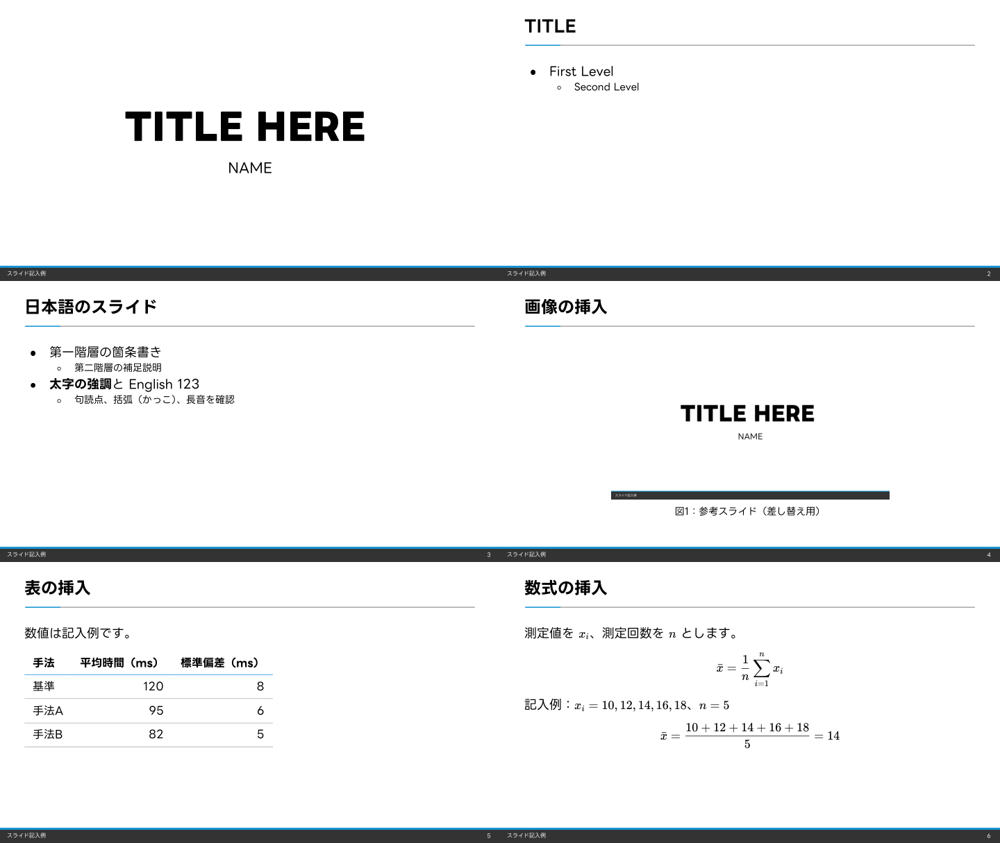

# hkaomua slide template

LINE Seed JPを使った、Marp、Beamer、Typstのスライドテンプレートです。
白背景、青い見出し線、濃いグレーのフッターを共通のデザインにしています。
Markdown、LaTeX、Typstの3形式で編集できます。



## 収録内容

3形式に、表紙、英語の箇条書き、日本語の箇条書き、画像、表、数式の6ページを収録しています。
見本の表の数値は架空の記入例です。

| 形式 | 編集するファイル | PDF見本 |
| --- | --- | --- |
| Marp / Markdown | [marp/slides.md](marp/slides.md) | [MarpのPDF](previews/marp.pdf) |
| Beamer / upLaTeX | [beamer/slides.tex](beamer/slides.tex) | [BeamerのPDF](previews/beamer.pdf) |
| Typst / Touying | [typst/slides.typ](typst/slides.typ) | [TypstのPDF](previews/typst.pdf) |

## 共通セットアップ

フォント本体はリポジトリに含めていません。
[LINE Seed公式サイト](https://seed.line.me/index_jp.html)から日本語版のLINE Seed JPをダウンロードし、ZIPを展開してください。
リポジトリのルートで、展開したフォルダを指定して実行します（Node.jsが必要です）。

```sh
node scripts/setup-fonts.mjs /path/to/LINESeedJP_20241105
```

Regular、Bold、ExtraBoldのOTFとWOFF2、およびOFLを`fonts/`にコピーします。
このスクリプトはネットワークに接続しません。
手動で配置する場合のファイル一覧は[fonts/README.md](fonts/README.md)を参照してください。
フォントは`.gitignore`でGit管理から除外しています。

## Marpで使う

Node.js 18以上とnpmを用意します。
PDF出力にはChrome、Edge、Firefoxのいずれかが必要です。
リポジトリのルートから実行してください。

```sh
cd marp
npm ci
npm run build
```

`marp/slides.html`と`marp/slides.pdf`が生成されます。
`npm run build`で、追加したフォントを埋め込んだCSSを生成します。
生成後は、VS Codeの「Marp for VS Code」でもプレビューできます。
テーマを登録するVS Code設定を同梱しています。

Markdownを編集した後は、`marp`フォルダで`npm run build`を実行します。
HTMLだけなら`npm run html`、PDFだけなら`npm run pdf`を使います。

フッターは`slides.md`冒頭の`footer`で変更します。
表紙のタイトルと名前は、本文の`# TITLE HERE`と`NAME`を変更してください。

```yaml
footer: '発表資料名'
```

本文は`---`でページを区切ります。

```markdown
---

# 研究の背景

- 第一階層の説明
  - 補足説明
```

色や余白を変更する場合は、[line-seed.source.css](marp/themes/line-seed.source.css)を編集します。
`npm run build`または`npm run theme`で生成済みCSSに反映されます。

## Beamerで使う

初回は共通セットアップの後、欧文の字幅データを生成します。
Python 3.9以上とfonttools、TeX Liveの`pltotf`を使います。
フォント本体と生成データはGit管理に含めません。

```sh
python3 -m venv .venv
.venv/bin/python -m pip install fonttools
.venv/bin/python scripts/setup-uptex-fonts.py
```

Windowsでは`.venv/bin/python`を`.venv/Scripts/python`に置き換えてください。
フォントを更新した場合は字幅データも再生成してください。

upLaTeX、dvipdfmx、latexmk、Beamer、otf、pxchfon、pxjahyper、ly1、TikZ、lmodern、colortblを用意します。
MacTeXや、これらを含むTeX Liveでビルドできます。
リポジトリのルートから実行してください。

```sh
cd beamer
latexmk slides.tex
```

`beamer/build/slides.pdf`が生成されます。
先に共通セットアップでフォントを追加してください。
フォントを相対パスで参照するため、ビルドは`beamer`フォルダ内で実行します。

VS Codeではリポジトリ全体、または`beamer`フォルダを開いてください。
LaTeX Workshopの「Build with recipe」で「upLaTeX → dvipdfmx (LINE Seed)」を選べます。
同梱の`.latexmkrc`がエンジンとフォントの検索先を設定します。
`ptex2pdf`を直接呼ぶ既存のレシピから、こちらのレシピへ切り替えてください。
別のエディターでも、作業ディレクトリを`beamer`にして`latexmk slides.tex`を実行します。

表紙とフッターは`slides.tex`の次の行を変更します。

```tex
\title{発表タイトル}
\author{発表者名}
\filename{発表資料名}
```

本文は通常の`frame`環境で追加します。

```tex
\begin{frame}{研究の背景}
  \begin{itemize}
    \item 第一階層の説明
      \begin{itemize}
        \item 補足説明
      \end{itemize}
  \end{itemize}
\end{frame}
```

テーマは[beamerthemelineSeed.sty](beamer/beamerthemelineSeed.sty)にまとめています。

## Typstで使う

[Typst CLI](https://github.com/typst/typst#installation)をインストールし、共通セットアップでフォントを追加します。
リポジトリのルートから実行してください。

```sh
node scripts/build-typst.mjs
```

`typst/build/slides.pdf`が生成されます。
Typst 0.15.1とTouying 0.7.4で確認しています。
Touyingのバージョンはソースで固定しており、初回ビルド時にTypstが必要なパッケージを取得します。
初回の取得にはインターネット接続が必要です。

`typst/slides.typ`冒頭の`title`、`author`、`filename`で、表紙とフッターを変更します。
本文は`==`でスライドを区切ります。

```typst
== 研究の背景

- 第一階層の説明
  - 補足説明
- *強調したい内容*
```

テーマは[typst/theme.typ](typst/theme.typ)です。
コマンドを直接実行する方法などは[Typst版の使い方](typst/README.md)を参照してください。

## 画像、表、数式

| 要素 | Marp | Beamer | Typst |
| --- | --- | --- | --- |
| 画像 | `` | `\includegraphics[width=400bp]{../assets/sample-slide.png}` | `#image("../assets/sample-slide.png", width: 400pt)` |
| 表 | Markdownの表 | `tabular`環境 | `#table(...)` |
| 文中の数式 | `$x_i$` | `$x_i$` | `$x_i$` |
| 独立した数式 | `$$...$$` | `\[...\]` | `$ ... $`（内側に空白） |

4〜6ページの記入例をコピーして使えます。
画像は`assets/`に置いて参照先を変更してください。
同梱画像はこのテンプレートの表紙をPNG化したものです。

## 共通のデザイン

| 要素 | 設定 |
| --- | --- |
| 縦横比 | 16:9 |
| 表紙タイトル | LINE Seed JP ExtraBold、52pt |
| 本文の見出し | LINE Seed JP Bold、24pt |
| 本文 / 第2階層 | LINE Seed JP Regular、18pt / 14pt |
| フッター | LINE Seed JP Regular、8pt |
| アクセント / 横線 / フッター背景 | `#1793D1` / `#AAAAAA` / `#333333` |

表紙を1枚目に数え、次のページからページ番号を表示します。
見出しは1行に収めてください。
長い表紙タイトルは、Marpの`title long-title`クラスやBeamerの`\seedtitleframe[36]`で文字を小さくできます。
ブラウザ、TeX、Typstの組版処理により、文字の空きや数式の字形には違いがあります。

## フォルダ構成

```text
marp/       Markdown、CSSテーマ、ビルド設定
beamer/     LaTeX、Beamerテーマ、ビルド設定
typst/      Typst、Touying用テーマ
fonts/      フォントの配置先（フォント本体は含みません）
assets/     3形式で使う画像
previews/   PDF見本
docs/       README用の画像
```

使い始めるときは、リポジトリ全体を取得してください。
`fonts/`と各形式のフォルダの相対位置を保てば、OSへのフォントインストールは不要です。
生成済みCSS、HTML、作業用PDF、`node_modules`、LaTeXの中間ファイル、Typstの作業用PDFはGit管理から除外しています。

## 開発時の確認

3形式をビルドし、生成したPDFで日本語、画像、表、数式、フッターを確認します。
デザインを変更した場合は、`previews/`のPDF見本も更新してください。

```sh
# リポジトリのルートで実行
npm --prefix marp ci
npm --prefix marp run build
cd beamer
latexmk slides.tex
cd ..
node scripts/build-typst.mjs
```

Marpのコマンドについては[公式ドキュメント](https://github.com/marp-team/marp-cli#basic-usage)を参照してください。

## ライセンス

テーマ、スクリプト、記入例、ドキュメントは[MIT License](LICENSE)で公開しています。
LINE Seed JPのフォントはMITの対象ではなく、SIL Open Font License 1.1が適用されます。
フォント本体は各自で公式サイトから取得してください。
PDF見本には表示に必要なフォントの一部が埋め込まれています。
その著作権表示とライセンスは[fonts/OFL.txt](fonts/OFL.txt)にあります。
