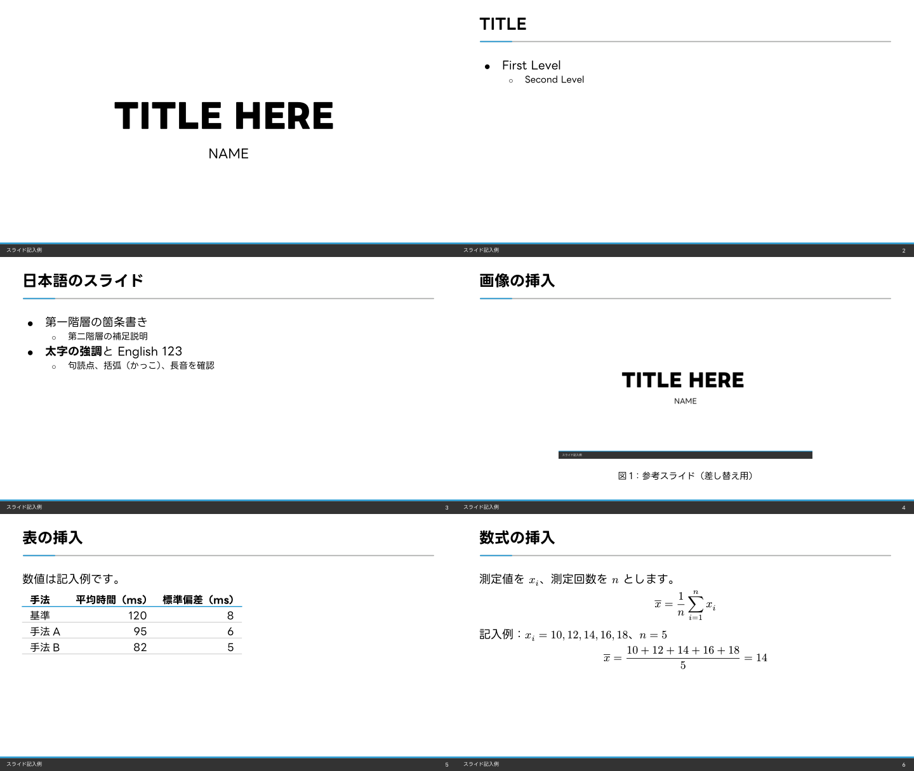

# Typst版

[Touying](https://typst.app/universe/package/touying)を使い、Marp版とBeamer版と共通のデザインで組版します。
本文は`slides.typ`、見た目は`theme.typ`に分けています。



## ビルド

Typst CLIをインストールし、リポジトリの`fonts/`にLINE Seed JPのOTFを配置してください。
フォントの追加手順は[fonts/README.md](../fonts/README.md)にあります。
Typst 0.15.1とTouying 0.7.4でビルドを確認しています。

リポジトリのルートで次のコマンドを実行します。

```sh
node scripts/build-typst.mjs
```

`typst/build/slides.pdf`が生成されます。
フォントが不足している場合は、追加方法を表示して終了します。
Typst CLIにPATHが通っていない場合は、環境変数`TYPST_BIN`に実行ファイルのパスを指定できます。

Node.jsを使わない場合は、フォントを手動で配置し、リポジトリのルートで直接ビルドできます。
このコマンドの出力先は`typst/slides.pdf`です。

```sh
typst compile --root . --font-path fonts --ignore-system-fonts typst/slides.typ typst/slides.pdf
```

`--root .`は、共通の`assets/`を参照するために必要です。
`--font-path fonts`は、追加したLINE Seed JPを見つけるために指定します。
Touyingとその依存パッケージは初回に自動取得され、以後はTypstのキャッシュを使用します。
パッケージ本体はこのリポジトリに含めていません。

## 本文の編集

表紙とフッターは`slides.typ`の冒頭で設定します。

```typst
#show: hkaomua-theme.with(
  title: [発表タイトル],
  author: [発表者名],
  filename: [発表資料名],
)
```

本文のスライドは`==`で始めます。
箇条書きは`-`、太字は`*...*`です。
表紙タイトルや本文見出しは1行に収めてください。
表紙を小さくする場合は`#title-slide(title-size: 36pt)`を使います。

```typst
== 研究の背景

- 第一階層の説明
  - 補足説明
- *強調したい内容*
```

画像、表、数式の例は4〜6ページにあります。
文中の数式は`$x_i$`、独立した数式は`$ ... $`のように内側に空白を入れます。
LaTeXの数式と記法が異なり、たとえば分数は`1/n`、平均は`overline(x)`と書きます。

```typst
$ overline(x) = 1/n sum_(i=1)^n x_i $
```

表紙は1ページ目に数え、番号の表示は本文の2ページ目から始まります。
ページ番号は出力PDFのページ番号に合わせています。

## ライセンス

このテーマと記入例はリポジトリのMITライセンスに従います。
TouyingはMITライセンス、LINE Seed JPはOFLに従います。
LINE Seedのフォント本体は同梱していません。
